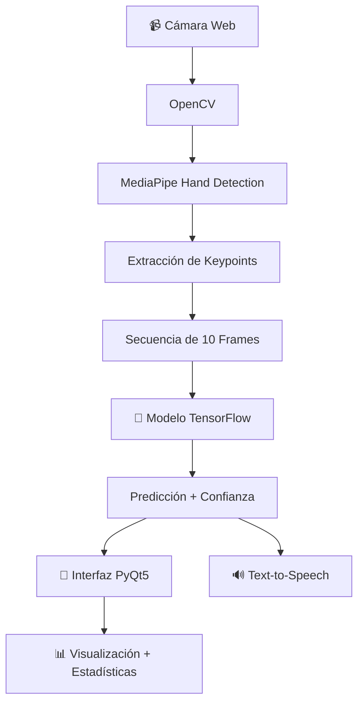

# 🤟 LESAI - Traductor de Lengua de Señas con IA

<div align="center">


**Un traductor inteligente de Lengua de Señas utilizando visión por computadora e inteligencia artificial**


</div>

---
---

## 🎯 Descripción

**LESAI** es una aplicación innovadora que utiliza **inteligencia artificial** y **visión por computadora** para traducir en tiempo real la **Lengua de Señas  (LESAI)** a texto y voz. El proyecto combina tecnologías de vanguardia como **MediaPipe**, **TensorFlow** y **OpenCV** para ofrecer una solución accesible que facilita la comunicación entre personas sordas y oyentes.

### 🌟 ¿Por qué LESAI?

- **🎯 Precisión**: Utiliza redes neuronales avanzadas para reconocimiento preciso de señas
- **⚡ Tiempo Real**: Traducción instantánea sin demoras perceptibles
- **🎨 Interfaz Moderna**: Diseño intuitivo y atractivo con tema oscuro profesional
- **📊 Análisis Avanzado**: Muestra confianza de predicciones y estadísticas detalladas
- **🔊 Síntesis de Voz**: Convierte el texto traducido a audio usando TTS
- **📱 Fácil de Usar**: Interfaz simple que cualquier persona puede usar

---

## ✨ Características

### 🚀 Funcionalidades Principales

| Característica | Descripción |
|----------------|-------------|
| **🎥 Captura en Tiempo Real** | Procesamiento de video desde cámara web en tiempo real |
| **🤖 IA Avanzada** | Red neuronal entrenada específicamente para LSA |
| **📊 Análisis de Confianza** | Visualización del nivel de certeza de cada predicción |
| **📝 Historial Completo** | Registro de todas las traducciones de la sesión |
| **🔊 Síntesis de Voz** | Conversión automática de texto a audio |
| **📈 Estadísticas** | Métricas detalladas de uso y rendimiento |
| **🎨 Interfaz Moderna** | Diseño profesional con tema oscuro |
| **⚙️ Fácil Configuración** | Instalación y configuración simplificadas |

### 🎯 Señas Reconocidas

Actualmente el sistema reconoce las siguientes señas básicas de LSA:

- 👋 **"Hola"** - Saludo básico
- 🙏 **"Gracias"** - Expresión de agradecimiento  
- 👋 **"Adiós"** - Despedida

> **Nota**: El sistema está diseñado para ser expandible. Puedes agregar más señas entrenando el modelo con nuevos datos.

---

## 🏗️ Arquitectura



### 🧠 Componentes Técnicos

- **🎥 Captura de Video**: OpenCV para manejo de cámara web
- **👋 Detección de Manos**: MediaPipe para localización precisa de manos
- **� Extracción de Características**: 216 puntos clave por frame (21 puntos × 2 manos × 3 coordenadas + pose)
- **🧠 Modelo de IA**: Red neuronal densa entrenada con secuencias temporales
- **🖥️ Interfaz de Usuario**: PyQt5 con diseño moderno y responsivo
- **🔊 Audio**: pyttsx3 para síntesis de voz en español

---

## ⚙️ Requisitos del Sistema

### 💻 Hardware Mínimo

- **Procesador**: Intel i3 / AMD equivalente o superior
- **Memoria RAM**: 4 GB mínimo (8 GB recomendado)
- **Cámara Web**: Resolución mínima 640x480
- **Espacio en Disco**: 2 GB libres
- **GPU**: Opcional (acelera el procesamiento con TensorFlow-GPU)

### 🖥️ Sistemas Operativos Soportados

- ✅ **Windows 10/11** (Recomendado)
- ✅ **macOS 10.14+**
- ✅ **Linux Ubuntu 18.04+**

---

## 🚀 Instalación

### 📋 Paso 1: Requisitos Previos

Asegúrate de tener **Python 3.11+** instalado:

```bash
python --version
```

### 📦 Paso 2: Clonar el Repositorio

```bash
git clone https://github.com/tu-usuario/LESAI.git
cd LESAI
```

### 🔧 Paso 3: Crear Entorno Virtual

```bash
# Windows
python -m venv venv
venv\Scripts\activate

# macOS/Linux
python3 -m venv venv
source venv/bin/activate
```

### 📚 Paso 4: Instalar Dependencias

```bash
pip install -r requirements.txt
```

### ✅ Paso 5: Verificar Instalación

```bash
python src/main_gui.py
```

Si todo está correcto, debería abrirse la interfaz gráfica.

---


### 📁 Persistencia de Datos

Los datos se mantienen entre ejecuciones gracias a los volúmenes:
- `./data/` → Imágenes y keypoints
- `./models/` → Modelos entrenados

---

## ��📱 Uso

### 🎬 Inicio Rápido

1. **Ejecutar la aplicación**:
   ```bash
   python src/main_gui.py
   ```

2. **Conectar cámara**: Asegúrate de que tu cámara web esté conectada y funcionando

3. **Iniciar traducción**: Haz clic en "▶️ Iniciar Traducción"

4. **Realizar señas**: Coloca tus manos frente a la cámara y realiza las señas

5. **Ver resultados**: La traducción aparecerá en tiempo real en el panel derecho

### 📊 Interpretando los Resultados

- **🟢 Verde**: Predicción exitosa (confianza > 70%)
- **🟠 Naranja**: Analizando señas en progreso
- **🔴 Rojo**: Error o confianza muy baja
- **⚫ Gris**: Sistema detenido

### 🎯 Tips para Mejores Resultados

- 💡 **Iluminación**: Usa buena iluminación, evita contraluz
- 🤲 **Posición**: Mantén las manos claramente visibles
- ⏱️ **Tiempo**: Realiza las señas de forma clara y pausada
- 📐 **Distancia**: Mantente a 60-80 cm de la cámara
- 🎯 **Fondo**: Usa fondos simples y contrastantes

---

## 🗂️ Estructura del Proyecto

```
LESAI/
├── 📁 assets/                  # Recursos gráficos
│   └── 🖼️ LS.png              # Logo del proyecto
├── 📁 data/                    # Datos de entrenamiento
│   ├── 📁 frame_actions/       # Imágenes por acción y secuencia
│   │   ├── 📁 adios/          # Señas de "adiós"
│   │   ├── 📁 gracias/        # Señas de "gracias"
│   │   └── 📁 hola/           # Señas de "hola"
│   └── 📁 keypoints/          # Puntos clave extraídos
│       ├── 📁 adios/          # Keypoints de "adiós"
│       ├── 📁 gracias/        # Keypoints de "gracias"
│       └── 📁 hola/           # Keypoints de "hola"
├── 📁 docs/                    # Documentación adicional
├── 📁 scripts/                 # Scripts de utilidad
├── 📁 src/                     # Código fuente principal
│   ├── 🎮 main_gui.py         # Interfaz principal
│   ├── 📸 capture_samples.py  # Captura de muestras
│   ├── 🔢 create_keypoints.py # Extracción de keypoints
│   ├── 🏋️ train_model.py      # Entrenamiento del modelo
│   └── 📁 models/             # Modelos entrenados
│       ├── 🧠 actions.keras   # Modelo principal
│       └── 📋 label_map.json  # Mapeo de etiquetas
├── 📁 tests/                   # Scripts de prueba
├── 📁 utils/                   # Utilidades del proyecto
│   ├── 📏 constants.py        # Constantes del proyecto
│   └── 🔊 text_to_speech.py   # Síntesis de voz
├── 📋 requirements.txt         # Dependencias de Python
├── 🙈 .gitignore              # Archivos ignorados por Git
└── 📖 README.md               # Este archivo
```

---

## 🔧 Configuración

### ⚙️ Parámetros Principales

Puedes modificar estos parámetros en `utils/constants.py`:

```python
# Configuración de secuencias  
SEQUENCE_LENGTH = 10               # Frames por secuencia
KEYPOINT_DIM = 216                # Dimensión de keypoints
NO_SEQUENCES = 30                 # Muestras por acción

# Señas reconocidas
ACTIONS = ['gracias', 'hola', 'adios']

# Rutas del proyecto
DATA_PATH = 'data/frame_actions'
KEYPOINTS_PATH = 'data/keypoints' 
MODELS_PATH = 'src/models'
```

### 🎨 Personalización de Tema

Modifica los colores en `main_gui.py`:


## 📊 Modelo y Datos

### 🧠 Arquitectura del Modelo

- **Entrada**: Secuencias de 10 frames × 216 keypoints (actualizado)
- **Capas Ocultas**: Red neuronal con capas LSTM para procesamiento secuencial
- **Activación**: ReLU en capas ocultas, Softmax en salida
- **Optimizador**: Adam con learning rate adaptativo
- **Pérdida**: Categorical Crossentropy
- **Clases**: 3 señas (hola, gracias, adiós)


### 📚 Expandir el Dataset

Para agregar nuevas señas al modelo:

1. **Capturar muestras nuevas**:

   ```bash
   python -m capture_samples.py
   ```

2. **Procesar keypoints**:

   ```bash
   python src/create_keypoints.py
   ```

3. **Reentrenar el modelo**:

   ```bash
   python src/train_model.py
   ```

El modelo se guardará automáticamente en `src/models/` y estará listo para usar.


### 🎯 Áreas de Mejora

- [ ] Soporte para más señas LSA (en progreso)
- [ ] Optimización de rendimiento con GPU
- [ ] Soporte para múltiples idiomas de señas
- [ ] Integración con dispositivos móviles
- [ ] Mejoras en la precisión del modelo con más datos
- [ ] Reconocimiento de expresiones faciales
- [ ] Modo de práctica interactivo

---

## 👥 Autores

<div align="center">


</div>


## 🚀 Roadmap

### 📅 Versión 2.0 (Próximamente)

- [ ] 🎯 **100+ señas LSA** nuevas
- [ ] 📱 **Aplicación móvil** (Android/iOS)
- [ ] 🌐 **Interfaz web** con WebRTC  
- [ ] 🔄 **Traducción bidireccional** (texto a señas)
- [ ] 🎓 **Modo educativo** con lecciones interactivas
- [ ] 🤖 **IA mejorada** con transformers

### 📅 Versión 1.5 (En desarrollo)

- [ ] 🎨 **Temas personalizables**
- [ ] 📊 **Dashboard de estadísticas avanzado**
- [ ] 💾 **Exportar historial** a PDF/CSV
- [ ] 🔊 **Configuración de voz** (velocidad, tono)
- [ ] 🎥 **Grabación de sesiones**

---

<div align="center">

**Hecho con 💙 para hacer la comunicación más accesible**

</div>
