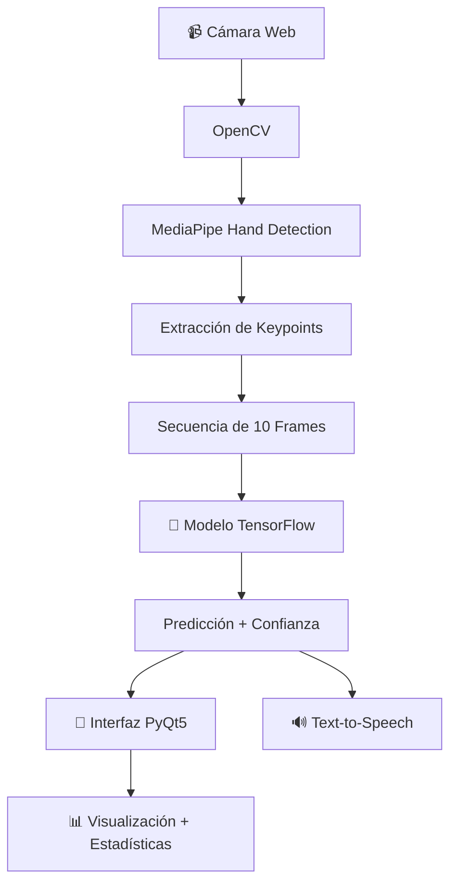

# 🤟 LESAI - Traductor de Lengua de Señas con IA

<div align="center">


✨ **Un traductor inteligente de Lengua de Señas utilizando visión por computadora e inteligencia artificial** ✨

</div>

---

## 🎯 Descripción

**LESAI** es una aplicación innovadora que emplea **inteligencia artificial (IA)** y **visión por computadora** para traducir en tiempo real la **Lengua de Señas (LS)** a **texto** y **voz**.  
Mediante **MediaPipe**, **TensorFlow** y **OpenCV**, ofrece una experiencia accesible y eficiente para facilitar la comunicación entre personas sordas y oyentes.

---

## 🌟 ¿Por qué LESAI?

- 🎯 **Precisión:** Reconocimiento avanzado gracias a redes neuronales especializadas.  
- ⚡ **Tiempo Real:** Traducción instantánea sin retrasos perceptibles.  
- 🎨 **Interfaz Moderna:** Diseño elegante con tema oscuro profesional.  
- 📊 **Análisis Avanzado:** Muestra niveles de confianza y métricas detalladas.  
- 🔊 **Síntesis de Voz:** Convierte el texto traducido en voz mediante TTS.  
- 📱 **Fácil de Usar:** Interfaz amigable para todos los usuarios.  

---

## ✨ Características

| Característica | Descripción |
|----------------|-------------|
| 🎥 **Captura en Tiempo Real** | Procesamiento continuo desde la cámara web. |
| 🤖 **IA Avanzada** | Modelo de aprendizaje profundo entrenado en señas LSA. |
| 📊 **Análisis de Confianza** | Nivel de certeza de cada predicción visualizado. |
| 📝 **Historial Completo** | Registro de las traducciones realizadas. |
| 🔊 **Conversión a Voz** | Lectura en voz alta de los textos traducidos. |
| 📈 **Estadísticas** | Visualización del rendimiento y métricas clave. |
| 🎨 **Diseño Moderno** | Interfaz con PyQt5 y tema oscuro. |
| ⚙️ **Fácil Configuración** | Instalación rápida con dependencias automáticas. |

---

## ✋ Señas Reconocidas

Actualmente el sistema puede reconocer las siguientes señas:

- 👋 **"Hola"** — Saludo básico.  
- 🙏 **"Gracias"** — Expresión de agradecimiento.  
- 👋 **"Adiós"** — Despedida común.  
- 👍​ **"Si"** — Afirmación.  
- 👎​ **"No"** — Negación.

> 💡 *El modelo es completamente expandible. Puedes añadir nuevas señas entrenando el sistema con tus propios datos.*

---

## 🧠 Arquitectura del Sistema



---

## 💻 Requisitos del Sistema

| Tipo | Especificación |
|------|----------------|
| **Procesador** | Intel i3 / AMD equivalente o superior |
| **Memoria RAM** | 4 GB mínimo (8 GB recomendado) |
| **Cámara Web** | Resolución mínima 640×480 |
| **Espacio en Disco** | 2 GB libres |
| **GPU** | Opcional (acelera el procesamiento con TensorFlow-GPU) |
| **Sistemas Soportados** | ✅ Windows 10/11 • ✅ macOS 10.14+ • ✅ Ubuntu 18.04+ |

---

## 🚀 Instalación

### 1️⃣ Requisitos Previos

Asegúrate de tener **Python 3.11+** instalado.

```bash
python --version
```

### 2️⃣ Clonar el Repositorio

```bash
git clone https://github.com/tu-usuario/LESAI.git
cd LESAI
```

### 3️⃣ Crear un Entorno Virtual

```bash
# Windows
python -m venv venv
venv\Scripts\activate

# macOS/Linux
python3 -m venv venv
source venv/bin/activate
```

### 4️⃣ Instalar Dependencias

```bash
pip install -r requirements.txt
```

### 5️⃣ Ejecutar la Aplicación

```bash
python src/main_gui.py
```

Si todo está correcto, se abrirá la interfaz gráfica. 🎉

---

## 📁 Estructura del Proyecto

```text
LESAI/
├── 📁 assets/                # Recursos visuales
│   └── 🖼️ LS.png            # Logo del proyecto
├── 📁 data/                  # Datos de entrenamiento
│   ├── frame_actions/        # Secuencias de imágenes por acción
│   └── keypoints/            # Puntos clave de las manos
├── 📁 src/                   # Código fuente
│   ├── main_gui.py           # Interfaz principal
│   ├── capture_samples.py    # Captura de muestras
│   ├── create_keypoints.py   # Extracción de keypoints
│   ├── train_model.py        # Entrenamiento del modelo
│   └── models/               # Modelos entrenados
├── 📁 utils/                 # Utilidades
│   ├── constants.py          # Parámetros de configuración
│   └── text_to_speech.py     # Síntesis de voz
├── 📋 requirements.txt       # Dependencias
└── 📖 README.md              # Este archivo
```

---

## 🧩 Arquitectura del Modelo

| Componente | Descripción |
|-------------|-------------|
| **Entrada** | Secuencias de 10 frames × 216 keypoints |
| **Capas Ocultas** | Red LSTM con activación ReLU |
| **Salida** | Softmax para clasificación de señas |
| **Optimizador** | Adam con tasa de aprendizaje adaptativa |
| **Pérdida** | Categorical Crossentropy |

---

## 🎯 Roadmap

### 🚀 Versión 2.0 (Próximamente)
- 📱 Aplicación móvil (Android/iOS)  
- 🌐 Interfaz web con WebRTC  
- 🎓 Modo educativo con práctica interactiva  
- 🤖 IA mejorada con transformers  
- 🖐️ 100+ señas LSA nuevas  

### ⚙️ Versión 1.5 (En desarrollo)
- 🎨 Temas personalizables  
- 📊 Dashboard avanzado  
- 💾 Exportar historial (PDF/CSV)  
- 🔊 Configuración de voz (tono, velocidad)  
- 🎥 Grabación de sesiones  

---

## 👥 Autores

<div align="center">

Desarrollado con 💙 por **Ara**  
Inspirado en una sociedad más **inclusiva, accesible y conectada**.

</div>

---

<div align="center">

✨ *Hecho con pasión para que la comunicación no tenga barreras.* ✨

</div>
